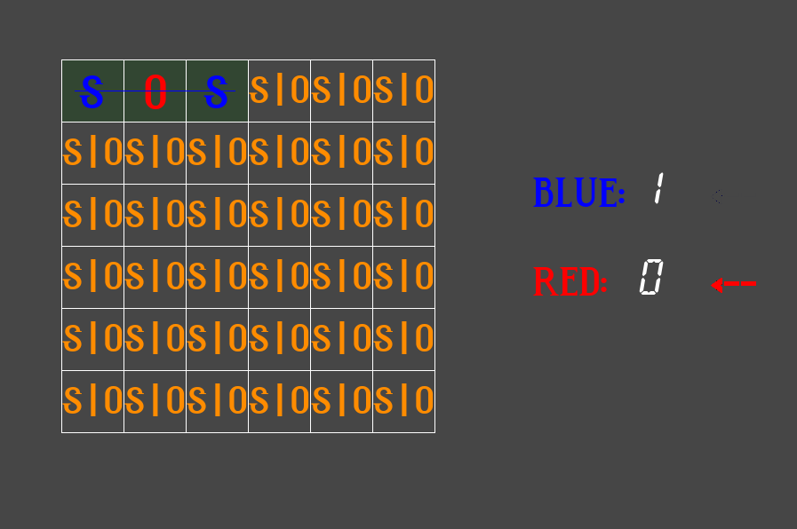
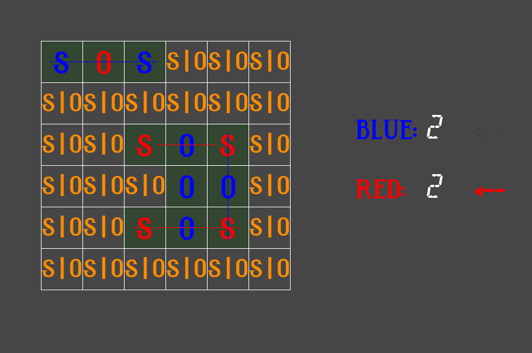

# S.O.S GAME


## Installation
To run the game you must install python.
```
$ sudo pacman -S python
$ sudo apt install python
$ sudo yum install python
```
PyGame library is also needed to start.
I use pip to install PyGame.
```
$ sudo pip install pygame
```
Finally run the game with.
```
$ ./sosGUI
```

## How to play?
Just align the letters S.O.S to get points.




